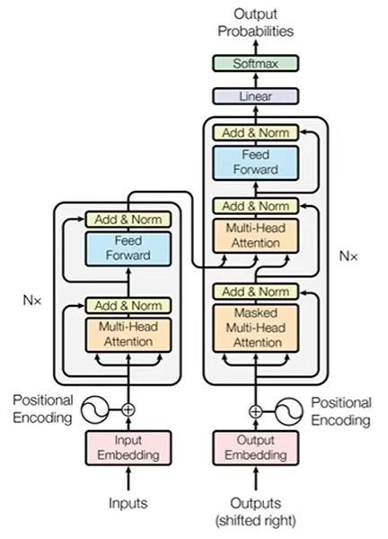
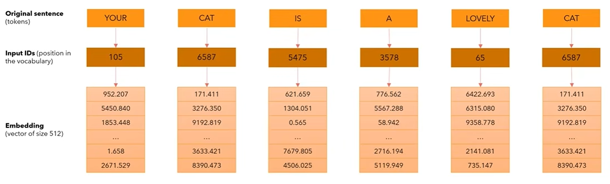
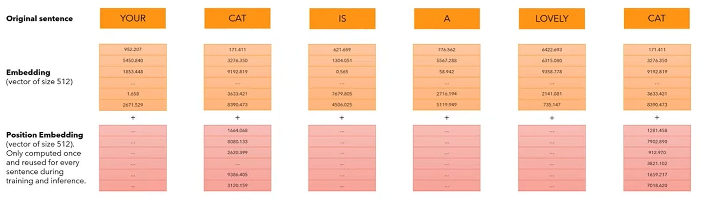
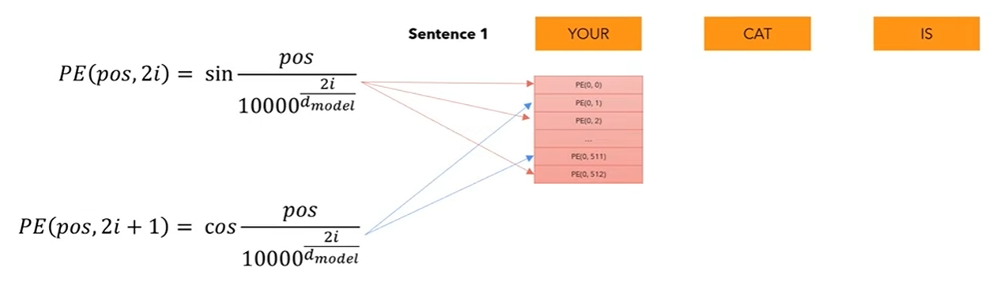
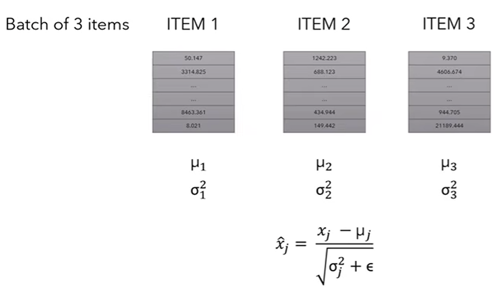
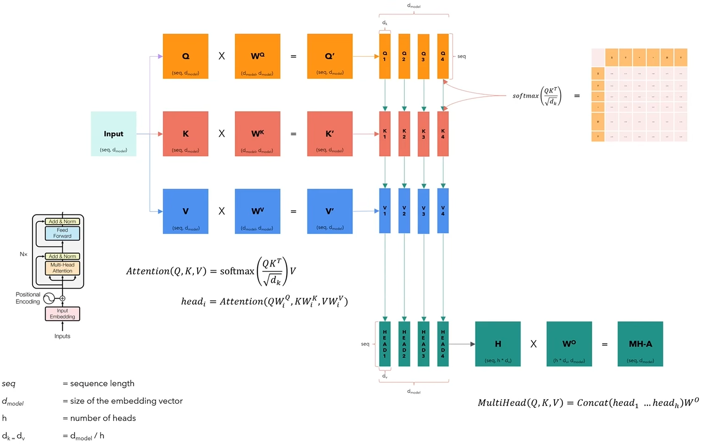
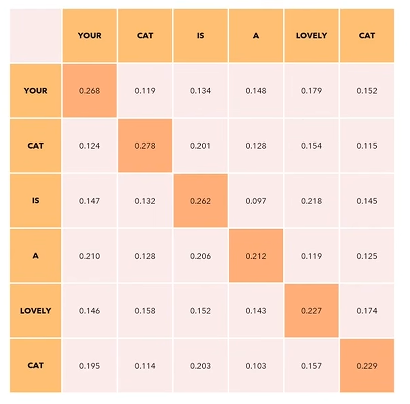

# Transformer from scratch

## Input Embedding

In the embedding layers, we multiply those weights by $\sqrt{d_{model}}$.

## Positional Encoding

## Layer Normalization

We also introduce two parameters, usually called **gamma** (multiplicative) and **beta** (additive) that introduce some fluctuations in the data, because maybe having all values between 0 and 1 may be too restrictive for the network. The network will learn to tune these two parameters to introduce fluctuations when necessary.

## Feed Forward

The feed-forward network consists of two linear transformations with a ReLU activation in between.

$$
FFN(x)=\max(0, xW_1+b_1)W_2+b_2
$$

Another way of describing this is as two convolutions with kernel size 1. The dimesionality of input and output is $d_{model}=512$, and the inner-layer has dimensionality $d_{ff}=2048$.

## Multi-Head Attention

## Residual Connection

We create residual connection to manage the skip connection. So we take the input, we skip it by one layer, we take the ouput of the previous layer (in this case the multi-head attention), then we combinie with this two parts.

## Dataset - Self-Attention in detail

- Self-Attention is permutation invariant.
- Self-Attention requires no parameters. Up to now the interaction between words has been driven by their embedding and the positional encodings. This will change later.
- We expect values along the diagonal to be the highest.
- If we don't want some positions to interact, we can always set their values to $-\infty$ before applying the softmax in this matrix and the model will not learn those interactions. We will use this in the decoder.